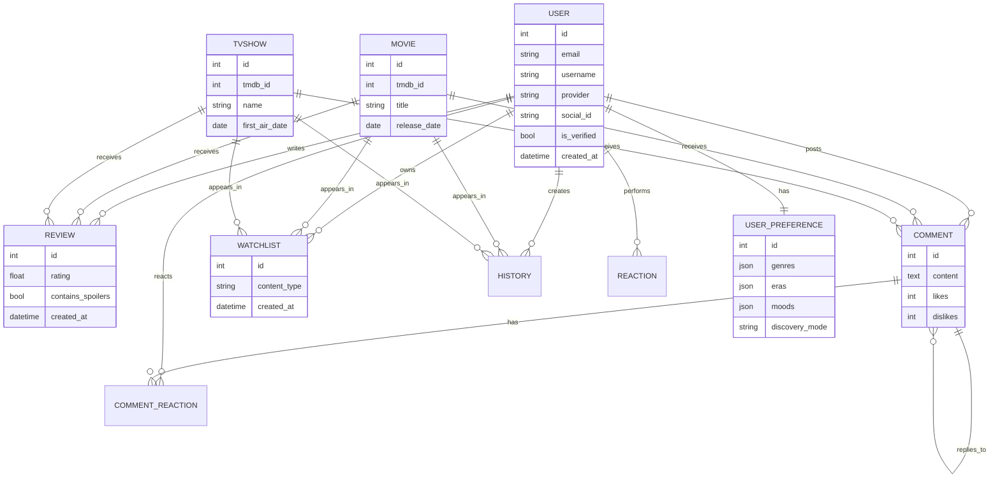

# Database Schema

This document describes the conceptual PostgreSQL schema used by ClipTalk.  
Exact model definitions and migration files are intentionally omitted.

## Core Entities

### User

Represents an account within ClipTalk.

Key concepts:

- Unique email and (optional) username
- Password hash for local accounts (nullable for purely OAuth-based accounts)
- Social login support via:
  - `provider` field (e.g., `local`, `google`, `facebook`)
  - `social_id` field (provider-specific identifier)
- Profile fields: names, bio, avatar URL, optional date of birth
- Status fields: `is_verified`, timestamps

Relationships:

- One-to-many with:
  - `Review`
  - `Comment`
  - `CommentReaction`
  - `Watchlist` entries
  - `History` entries
  - `Reaction` entities (e.g., ratings/likes on content)
- One-to-one with:
  - `UserPreference` (preference profile)

### Movie & TVShow

Represent film and TV catalog items, backed primarily by TMDb data.

Key concepts:

- Store stable identifiers (e.g., TMDb IDs) and core metadata locally:
  - title, overview, release/air dates
  - poster/backdrop paths
- Support relations to:
  - `Review`
  - `Comment`
  - `Watchlist`
  - `History`
  - `Trailer`

TV shows additionally relate to:

- `Season`
- `Episode`

### Review

User-generated review for either a movie or TV show.

Key concepts:

- Numeric rating (e.g., 1–5)
- Optional text content (with length limits at validation layer)
- Optional spoiler flag
- Timestamps (created/updated)
- Polymorphic target:
  - `movie_id` (nullable)
  - `tv_show_id` (nullable)
  - exactly one of these should be set

Relationships:

- Many-to-one with `User`
- Many-to-one with `Movie` or `TVShow`

### Comment & CommentReaction

Comments are threaded discussions on movies or TV shows.

Comment:

- Text content
- Timestamps
- Aggregate like/dislike counters
- Parent–child relationship to support nesting
- Polymorphic target similar to `Review`:
  - `movie_id` or `tv_show_id`
- Self-referential relationship for replies via `parent_id`

CommentReaction:

- Separate table modeling per-user reactions to comments
- Stores `type` (e.g., like/dislike) and timestamps
- Unique constraint `(user_id, comment_id)` to prevent duplicates
- Many-to-one with `User` and `Comment`

### Watchlist

Represents a user’s intent to watch certain content later.

Key concepts:

- One entry per user/content pair
- `content_type` (e.g., `movie` or `tv`) for clarity
- Foreign keys:
  - `user_id`
  - `movie_id` (nullable)
  - `tv_show_id` (nullable)
- Timestamps for when an item was added

Relationships:

- Many-to-one with `User`
- Many-to-one with `Movie` or `TVShow`

### History

Tracks user engagement over time (e.g., watched or interacted-with content).

- Similar linkage to movies/TV as Watchlist
- Includes timestamps and possibly interaction type events

### UserPreference

Stores personalization preferences for a single user.

Key concepts:

- One-to-one with `User`
- Fields stored as JSON arrays (e.g., `genres`, `eras`, `moods`)
- A `discovery_mode` string (e.g., casual explore vs focused search)
- Created/updated timestamps

This structure provides a compact, schema-flexible way to store preferences used by recommendation logic.

## ER-style Overview

## Design Considerations

- **Polymorphic associations**: Instead of heavy polymorphic frameworks, the schema uses nullable foreign keys (`movie_id`, `tv_show_id`) for entities that can target either movies or TV shows.
- **Soft vs hard constraints**: Some business rules (e.g., “exactly one of movie_id or tv_show_id must be set”) are enforced in the application layer, not solely at the DB level.
- **JSON columns for preferences**: Preferences are stored as JSON for flexibility while keeping the main schema stable.
- **Cascade deletes for user content**: Many relationships use cascade behavior so removing a user automatically cleans up dependent content.

This schema balances relational integrity with practical flexibility for rapid product iteration.
